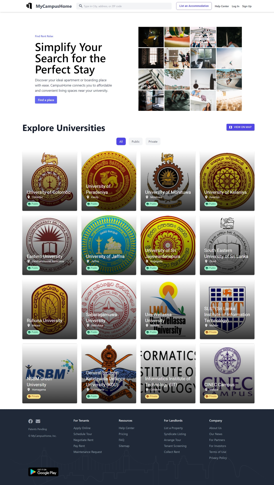

# MyCampusHome

MyCampusHome is a MERN (MongoDB, Express.js, React.js, Node.js) stack web application designed to assist students in finding the perfect student accommodations. The platform offers an intuitive interface, responsive design, and integration with modern authentication and payment systems.

## Features

- **User Authentication**: Secure login and registration functionality with JWT.
- **Responsive Design**: Fully responsive UI built with Tailwind CSS, ensuring usability across devices.
- **Google Authentication**: One-click sign-in with Google.
- **Dynamic Search**: Explore student accommodations by location, price, and preferences.
- **Booking System**: Reserve and manage bookings easily.
- **Admin Panel**: Admin dashboard for managing properties, users, and bookings.

## Screenshots

Here are some screenshots of the MyCampusHome application:

### Homepage


### Login Page


### Accommodation Search


### Booking Confirmation


## Tech Stack

### Frontend
- **React.js**: Framework for building the user interface.
- **Tailwind CSS**: For styling the application.
- **React Router**: To handle navigation.
- **Axios**: For API requests.

### Backend
- **Node.js**: Server-side runtime.
- **Express.js**: Web application framework.
- **MongoDB**: Database for storing application data.
- **Mongoose**: MongoDB object modeling for Node.js.

### Authentication & Payment
- **JWT**: Secure JSON Web Tokens for user authentication.
- **Google OAuth**: Login using Google accounts.
- **Stripe (Planned)**: Seamless payment integration for bookings.

## Installation and Setup

### Prerequisites
- Node.js and npm installed
- MongoDB Atlas account or local MongoDB instance
- A Google Cloud Project for OAuth setup

### Frontend Setup

1. Clone the repository:
   ```bash
   git clone https://github.com/De-Silva-Madhushankha/MyCampusHome.git
   ```
2. Navigate to the client directory:
   ```bash
   cd mycampushome/client
   ```
3. Install dependencies:
   ```bash
   npm install
   ```
4. Start the development server:
   ```bash
   npm start
   ```

### Backend Setup

1. Navigate to the backend directory:
   ```bash
   cd mycampushome/server
   ```
2. Install dependencies:
   ```bash
   npm install
   ```
3. Configure environment variables:
   Create a `.env` file in the backend directory with the following:
   ```env
   MONGO_URI=your-mongodb-uri
   JWT_SECRET=your-jwt-secret
   GOOGLE_CLIENT_ID=your-google-client-id
   GOOGLE_CLIENT_SECRET=your-google-client-secret
   ```
4. Start the server:
   ```bash
   npm start
   ```

## Future Enhancements
- **Payment Integration**: Implement Stripe for handling payments.
- **User Notifications**: Notify users about booking updates and offers.
- **Enhanced Search**: Add filters for more specific accommodation searches.

## Contributing
Contributions are welcome! Please fork the repository and submit a pull request for any features, bug fixes, or enhancements.

## License
This project is licensed under the [MIT License](LICENSE).

